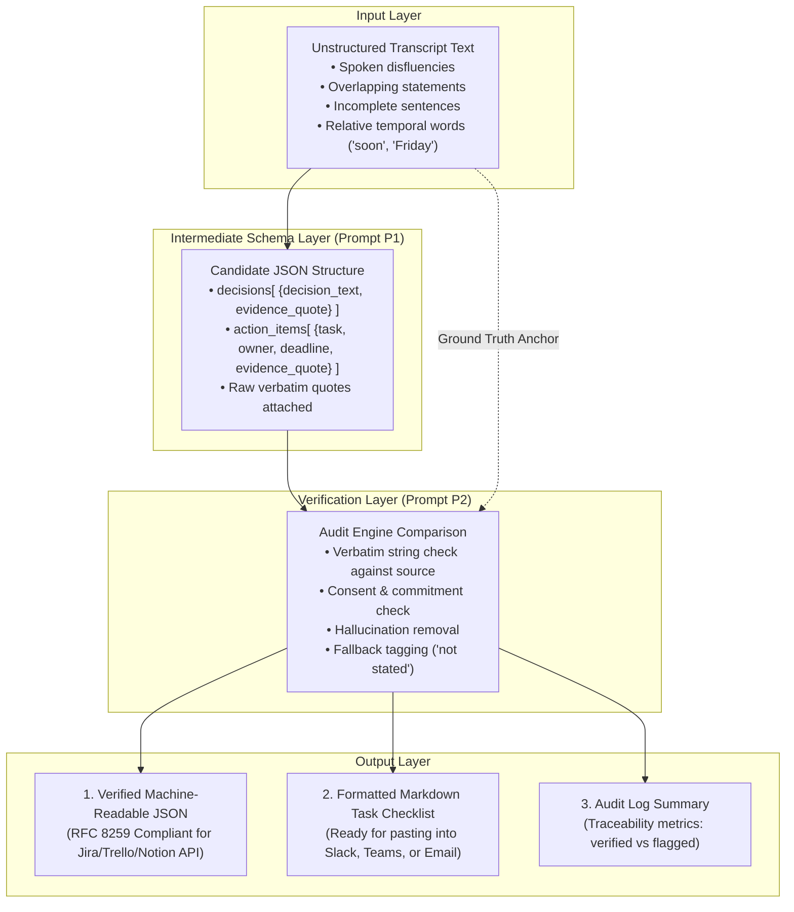

# Input-Output Flow Diagram

```mermaid
flowchart TD
    subgraph Inputs ["Input Layer"]
        In1["Unstructured Transcript Text<br/>• Spoken disfluencies<br/>• Overlapping statements<br/>• Incomplete sentences<br/>• Relative temporal words ('soon', 'Friday')"]
    end

    subgraph Intermediate ["Intermediate Schema Layer (Prompt P1)"]
        Inter1["Candidate JSON Structure<br/>• decisions[ {decision_text, evidence_quote} ]<br/>• action_items[ {task, owner, deadline, evidence_quote} ]<br/>• Raw verbatim quotes attached"]
    end

    subgraph Verification ["Verification Layer (Prompt P2)"]
        Ver1["Audit Engine Comparison<br/>• Verbatim string check against source<br/>• Consent & commitment check<br/>• Hallucination removal<br/>• Fallback tagging ('not stated')"]
    end

    subgraph Outputs ["Output Layer"]
        Out1["1. Verified Machine-Readable JSON<br/>(RFC 8259 Compliant for Jira/Trello/Notion API)"]
        Out2["2. Formatted Markdown Task Checklist<br/>(Ready for pasting into Slack, Teams, or Email)"]
        Out3["3. Audit Log Summary<br/>(Traceability metrics: verified vs flagged)"]
    end

    In1 --> Inter1
    Inter1 --> Ver1
    In1 -.->|"Ground Truth Anchor"| Ver1
    Ver1 --> Out1
    Ver1 --> Out2
    Ver1 --> Out3
```
