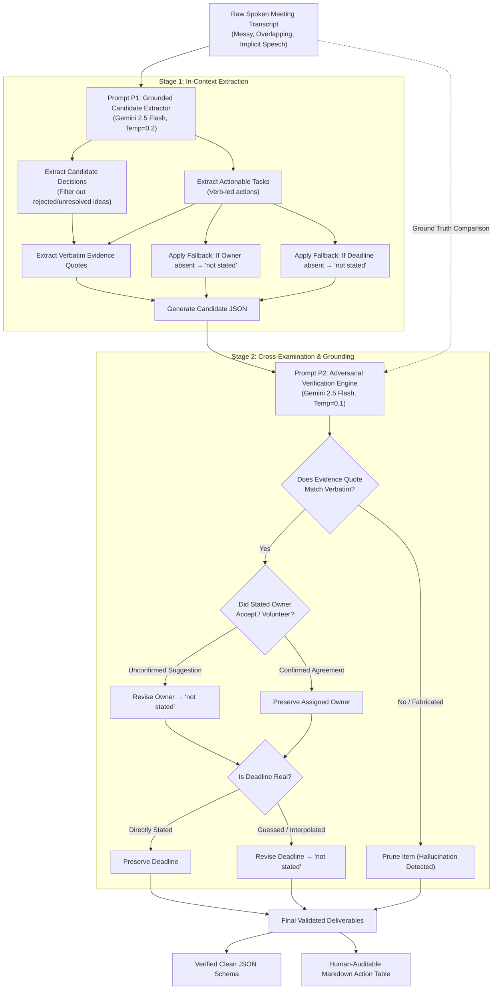

# Prompt Workflow Diagram

```mermaid
flowchart TD
    A["Raw Spoken Meeting Transcript<br/>(Messy, Overlapping, Implicit Speech)"] --> B["Prompt P1: Grounded Candidate Extractor<br/>(Gemini 2.5 Flash, Temp=0.2)"]
    
    subgraph P1_Stage ["Stage 1: In-Context Extraction"]
        B --> C["Extract Candidate Decisions<br/>(Filter out rejected/unresolved ideas)"]
        B --> D["Extract Actionable Tasks<br/>(Verb-led actions)"]
        C --> E["Extract Verbatim Evidence Quotes"]
        D --> E
        D --> F["Apply Fallback: If Owner absent &rarr; 'not stated'"]
        D --> G["Apply Fallback: If Deadline absent &rarr; 'not stated'"]
        E --> H["Generate Candidate JSON"]
        F --> H
        G --> H
    end
    
    H --> I["Prompt P2: Adversarial Verification Engine<br/>(Gemini 2.5 Flash, Temp=0.1)"]
    A -.->|"Ground Truth Comparison"| I
    
    subgraph P2_Stage ["Stage 2: Cross-Examination & Grounding"]
        I --> J{"Does Evidence Quote<br/>Match Verbatim?"}
        J -- "No / Fabricated" --> K["Prune Item (Hallucination Detected)"]
        J -- "Yes" --> L{"Did Stated Owner<br/>Accept / Volunteer?"}
        L -- "Unconfirmed Suggestion" --> M["Revise Owner &rarr; 'not stated'"]
        L -- "Confirmed Agreement" --> N["Preserve Assigned Owner"]
        M --> O{"Is Deadline Real?"}
        N --> O
        O -- "Guessed / Interpolated" --> P["Revise Deadline &rarr; 'not stated'"]
        O -- "Directly Stated" --> Q["Preserve Deadline"]
    end
    
    Q --> R["Final Validated Deliverables"]
    P --> R
    K --> R
    
    R --> S["Verified Clean JSON Schema"]
    R --> T["Human-Auditable Markdown Action Table"]
```
