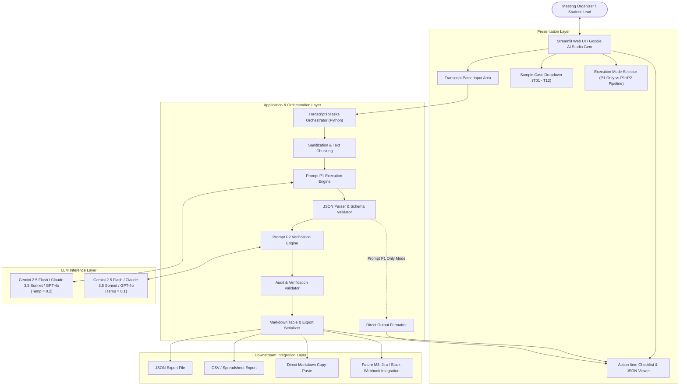

# System Architecture Diagram

```mermaid
flowchart TD
    User(["Meeting Organizer / Student Lead"]) <--> UI["Streamlit Web UI / Google AI Studio Gem"]
    
    subgraph Frontend ["Presentation Layer"]
        UI --> U1["Transcript Paste Input Area"]
        UI --> U2["Sample Case Dropdown (T01 - T12)"]
        UI --> U3["Execution Mode Selector (P1 Only vs P1+P2 Pipeline)"]
        UI --> U4["Action Item Checklist & JSON Viewer"]
    end
    
    subgraph Application_Core ["Application & Orchestration Layer"]
        U1 --> Runner["TranscriptToTasks Orchestrator (Python)"]
        Runner --> Pre["Sanitization & Text Chunking"]
        Pre --> P1_Exec["Prompt P1 Execution Engine"]
        P1_Exec --> Parse1["JSON Parser & Schema Validator"]
        Parse1 --> P2_Exec["Prompt P2 Verification Engine"]
        Parse1 -.->|"Prompt P1 Only Mode"| DirectFormat["Direct Output Formatter"]
        P2_Exec --> Parse2["Audit & Verification Validator"]
        Parse2 --> Post["Markdown Table & Export Serializer"]
    end
    
    subgraph Model_Layer ["LLM Inference Layer"]
        P1_Exec <--> LLM1["Gemini 2.5 Flash / Claude 3.5 Sonnet / GPT-4o<br/>(Temp = 0.2)"]
        P2_Exec <--> LLM2["Gemini 2.5 Flash / Claude 3.5 Sonnet / GPT-4o<br/>(Temp = 0.1)"]
    end
    
    subgraph Storage_and_Export ["Downstream Integration Layer"]
        Post --> D1["JSON Export File"]
        Post --> D2["CSV / Spreadsheet Export"]
        Post --> D3["Direct Markdown Copy-Paste"]
        Post --> D4["Future M3: Jira / Slack Webhook Integration"]
    end
    
    Post --> U4
    DirectFormat --> U4
```
