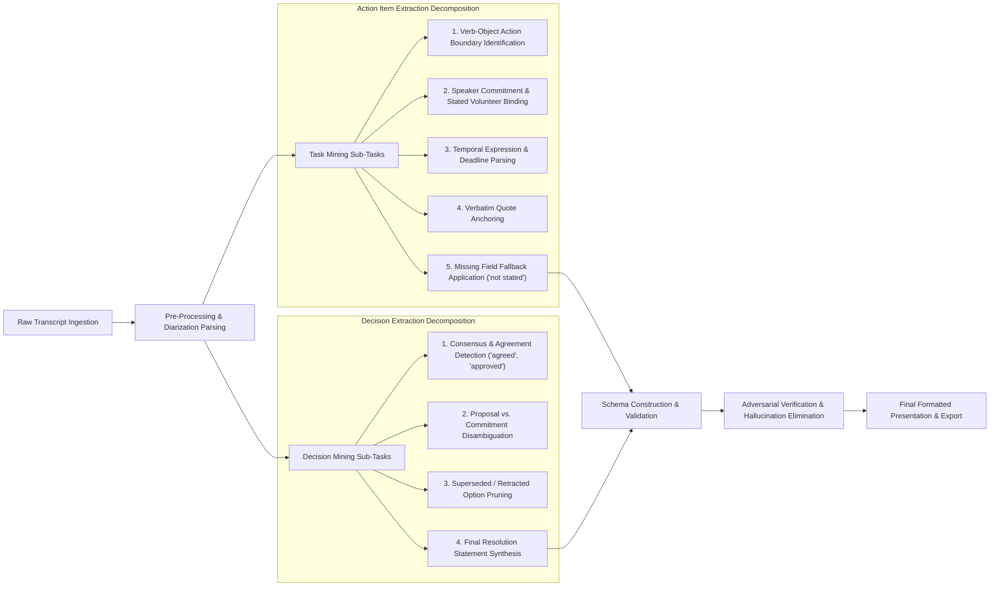

# Task Decomposition Diagram

```mermaid
flowchart LR
    A["Raw Transcript Ingestion"] --> B["Pre-Processing & Diarization Parsing"]
    
    B --> C["Task Mining Sub-Tasks"]
    B --> D["Decision Mining Sub-Tasks"]
    
    subgraph Action_Items ["Action Item Extraction Decomposition"]
        C --> C1["1. Verb-Object Action Boundary Identification"]
        C --> C2["2. Speaker Commitment & Stated Volunteer Binding"]
        C --> C3["3. Temporal Expression & Deadline Parsing"]
        C --> C4["4. Verbatim Quote Anchoring"]
        C --> C5["5. Missing Field Fallback Application ('not stated')"]
    end
    
    subgraph Decisions ["Decision Extraction Decomposition"]
        D --> D1["1. Consensus & Agreement Detection ('agreed', 'approved')"]
        D --> D2["2. Proposal vs. Commitment Disambiguation"]
        D --> D3["3. Superseded / Retracted Option Pruning"]
        D --> D4["4. Final Resolution Statement Synthesis"]
    end
    
    C5 --> E["Schema Construction & Validation"]
    D4 --> E
    
    E --> F["Adversarial Verification & Hallucination Elimination"]
    F --> G["Final Formatted Presentation & Export"]
```
